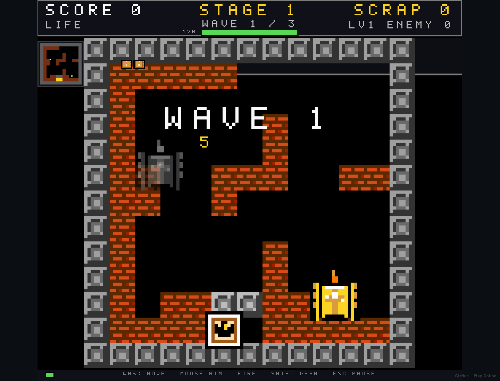

# 铁甲回廊 · Iron Corridor

在程序化回廊中驾驶坦克作战，以三选一强化和废料升级挑战更深层地牢。

A tank dungeon roguelike with procedural corridors, upgrades, bosses and scrap progression.

[在线体验](https://tank-roguelike.xiaosang.cc/) · [源码](https://github.com/holynova/tank-roguelike)



## 可以做什么

- 鼠标瞄准，键盘移动、冲刺与切换武器。
- 每局强化与永久升级形成两层成长。

## 怎么玩

WASD / 方向键驾驶，鼠标瞄准，左键 / 空格开火；Shift / F冲刺，Q/E或滚轮切换武器，Esc / P暂停。

## 本地运行

```bash
npm ci
npm run dev
# 生成生产产物
npm run build
```

游戏素材来自Kenney，具体资源与使用方式见 `public/`；代码许可声明以仓库文件为准。


## 发布

```bash
npm run build
npx --yes wrangler@4.128.0 deploy --config wrangler.jsonc
```

从 `master` 同一提交在本地手动发布到Cloudflare Workers。正式地址：[https://tank-roguelike.xiaosang.cc/](https://tank-roguelike.xiaosang.cc/)。
