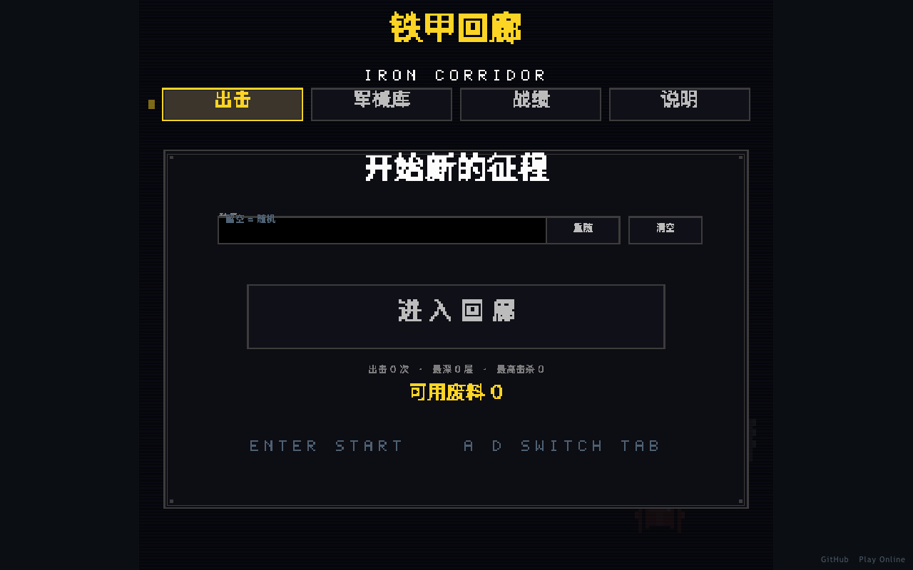

# 铁甲回廊 · Iron Corridor

**坦克大战 × Roguelike** — 浏览器直玩的俯视角坦克 Roguelike。程序化生成回廊、
三选一强化、每 5 层 BOSS、废料兑换永久强化，一命通关 30 层。



- **在线游玩**：<https://holynova.github.io/tank-roguelike/>
- **源码仓库**：<https://github.com/holynova/tank-roguelike>


## 操作

| 操作 | 按键 |
| --- | --- |
| 驾驶 | `W` `A` `S` `D` / 方向键 |
| 瞄准 / 开火 | 鼠标 / 左键 / `空格` |
| 冲刺 | `Shift` / `F` |
| 切换武器 | 滚轮 / `Q` `E` |
| 暂停 | `ESC` / `P` |

## 开发

```bash
npm install
npm run dev      # 本地开发
npm run build    # 类型检查 + 打包到 dist/
```

Phaser 3 + TypeScript + Vite；美术、字体、音效均来自 Kenney（CC0）。
